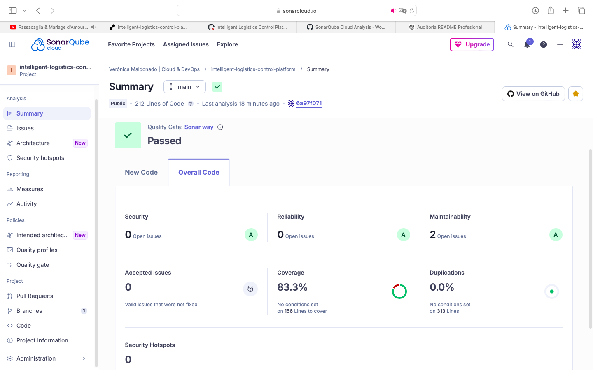
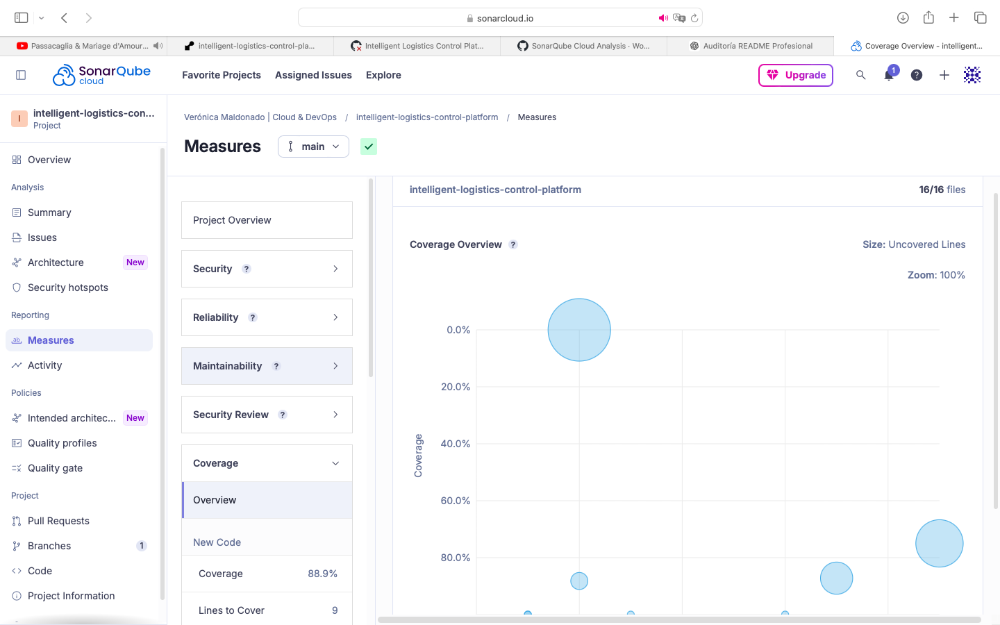

# 🚀 Intelligent Logistics Control Platform


---

Plataforma desplegada en producción que simula decisiones operacionales en procesos logísticos críticos, integrando validación documental, control de acceso y análisis de riesgo operacional.

CI Quality Gate Coverage Python

---

## 🔗 API en producción

https://intelligent-logistics-control-platform.onrender.com

## 🔗 Swagger

https://intelligent-logistics-control-platform.onrender.com/docs

✔ Deploy automático desde GitHub
✔ API pública accesible
✔ Documentación interactiva
✔ Runtime en cloud

⚠️ Nota: al estar en free tier, puede tardar unos segundos en iniciar.

---

## 📸 Evidencia real en producción

🌐 API desplegada en Render


📘 Swagger en producción


⚙️ Logs de ejecución


---

## 🧠 Descripción

Simulación de una plataforma inteligente de control logístico, diseñada para automatizar decisiones críticas en procesos de transporte y comercio exterior.

El sistema integra validación documental, control de acceso y análisis de riesgo operacional, permitiendo simular un flujo real de decisión automatizada en entornos logísticos complejos.

---

## 🎯 Objetivo

Diseñar una solución tecnológica orientada a negocio que permita:

* Reducir riesgos operacionales
* Disminuir errores manuales
* Mejorar tiempos de validación
* Aumentar trazabilidad y control

---

## 🧩 Problema de Negocio

En operaciones logísticas reales existen múltiples puntos críticos:

* Validación manual de documentos
* Ingreso de camiones no autorizados
* Falta de control sobre conductores y vehículos
* Evaluación tardía de riesgos operacionales
* Procesos lentos y propensos a error

👉 Impacto directo:

* Seguridad operativa
* Continuidad del servicio
* Trazabilidad
* Eficiencia del proceso

---

## 📊 Antes vs Después

| Antes                 | Después                                    |
| --------------------- | ------------------------------------------ |
| Validaciones manuales | Validación automatizada                    |
| Procesos lentos       | Decisiones automatizadas basadas en reglas |
| Alto riesgo operativo | Evaluación automatizada de riesgo          |
| Baja trazabilidad     | Trazabilidad completa de decisiones        |

---

## 💡 Solución

Se desarrolló una API que simula un motor de decisiones inteligente, capaz de:

* ✔️ Validar documentación
* ✔️ Evaluar condiciones de acceso
* ✔️ Analizar riesgo operacional
* ✔️ Orquestar decisiones
* ✔️ Generar tickets de acceso
* ✔️ Emitir notificaciones

---

## 🏗️ Arquitectura de la solución

La solución está diseñada bajo un enfoque modular, separando responsabilidades en capas:

* **API Layer** → exposición de endpoints (FastAPI)
* **Orchestration Layer** → lógica de decisión central
* **Services Layer** → reglas de negocio desacopladas

### 📦 Componentes principales

```bash
app/
├── api.py                # API FastAPI
├── orchestrator.py       # Motor de decisiones
└── services/             # Lógica de negocio
```

👉 Este diseño permite:

* Escalabilidad
* Mantenibilidad
* Separación de responsabilidades
* Evolución hacia microservicios

---

### 📊 Flujo operacional de la solución

Este flujo representa cómo se orquesta la toma de decisiones operacionales dentro del sistema.

```markdown

```


---

## 🧠 Enfoque del Proyecto

Este proyecto está diseñado desde una perspectiva de Delivery y negocio, no solo técnica.

Se enfoca en:

✔ Modelamiento de decisiones operacionales reales
✔ Orquestación de múltiples reglas de negocio
✔ Simulación de escenarios críticos de riesgo
✔ Generación de outputs trazables y explicables

👉 Representa cómo un sistema real tomaría decisiones en entornos logísticos complejos.

---

## 🔄 Flujo de la Solución

1. Recepción de datos de operación logística
2. Validación de documentos
3. Evaluación de acceso (conductor, vehículo, carga)
4. Análisis de riesgo (fatiga, GPS, historial)
5. Toma de decisión automatizada (basada en reglas)
6. Generación de ticket
7. Envío de notificación

📌 Ver diagrama: diagrams/flujo_operacional_general.png

---

## 🚨 Escenarios de decisión (evidencia real)

La API fue validada mediante pruebas reales en Swagger, simulando distintos escenarios operacionales de negocio.

🔗 Swagger en producción: https://intelligent-logistics-control-platform.onrender.com/docs

❌ Caso 1: Rechazo por documentos faltantes
👉 Resultado: "operation_status": "REJECTED"

❌ Caso 2: Documento expirado
👉 Resultado: "operation_status": "REJECTED"

⚠️ Caso 3: Riesgo alto
👉 Resultado: "operation_status": "REVIEW_REQUIRED"

✔️ Caso 4: Operación aprobada
👉 Resultado: "operation_status": "APPROVED"

---

## 📸 Evidencia de ejecución (Swagger)

| Caso                 | Resultado       | Evidencia                             |
| -------------------- | --------------- | ------------------------------------- |
| Documentos faltantes | REJECTED        |  |
| Acceso inválido      | REJECTED        |     |
| Riesgo alto          | REVIEW_REQUIRED |           |
| Operación válida     | APPROVED        |            |

👉 Estos escenarios demuestran la capacidad del sistema para simular decisiones operacionales en contextos logísticos reales.

---

## 🔌 Endpoints

### ✔️ Health Check

GET /health

```
{"status": "ok"}
```

---

### ✔️ Evaluación de Operación

POST /evaluate

---

## 🧪 Pruebas y Calidad

Ejecución de tests:

```
pytest -v
```

Cobertura:

```
pytest --cov=app
```

✔️ Integrado en CI con GitHub Actions
✔️ Validación de calidad con SonarCloud
✔️ Control de cobertura automatizado

---

## ⚙️ Tecnologías

* Python
* FastAPI
* Pytest
* Flake8
* Coverage
* GitHub Actions (CI)
* SonarCloud (Quality Gate)

---

## ⚙️ Integración CI/CD y Calidad

Este proyecto incorpora un pipeline automatizado de integración continua (CI) utilizando GitHub Actions.

✔️ Ejecución de tests con Pytest
✔️ Análisis de código con Flake8
✔️ Formateo con Black
✔️ Generación de cobertura
✔️ Análisis de calidad con SonarCloud

🔄 Flujo del pipeline:

Push → GitHub Actions → Tests → Lint → Coverage → SonarCloud → Resultado

---

---

## 📊 Evidencia de Calidad (SonarCloud)

Análisis automático de código estático y calidad del proyecto en cada ejecución del pipeline.

🔗 Proyecto en SonarCloud:
https://sonarcloud.io/summary/new_code?id=vermaldonado-ia_intelligent-logistics-control-platform

---

### 🔍 Quality Gate



---

### 📈 Cobertura de código



---

### 🧠 Métricas principales

✔ Quality Gate: Passed
✔ Coverage: ~85%
✔ Maintainability: A
✔ Reliability: A
✔ Security: A

💡 Estas métricas se actualizan automáticamente en cada ejecución del pipeline CI/CD.

---

## 🚀 Ejecución local

Crear entorno virtual:

```
python -m venv venv
```

Activar:

macOS / Linux

```
source venv/bin/activate
```

Windows

```
venv\Scripts\activate
```

Instalar dependencias:

```
pip install -r requirements.txt
```

Ejecutar API:

```
python -m uvicorn app.api:app --reload
```

Swagger:

http://127.0.0.1:8000/docs

---

## 📈 Valor para el negocio

✔ Reducir exposición a riesgos operacionales
✔ Mejorar tiempos de validación
✔ Automatizar validación documental
✔ Incrementar trazabilidad
✔ Sentar base para sistemas logísticos reales

---

## 🚀 Próximos pasos

✔ Integración con APIs reales
✔ Modelos de IA para scoring de riesgo
✔ Arquitectura distribuida
✔ Integración con IoT

---

## 🎯 Valor diferencial del proyecto

✔ Diseño orientado a negocio
✔ Modelamiento de procesos reales
✔ Automatización de decisiones
✔ Integración DevOps (CI/CD + despliegue)
✔ Entrega en producción

👉 Representa el rol de un Delivery Manager en entornos tecnológicos modernos.

---

## 🚀 Estrategia de Desarrollo

El desarrollo del producto se estructura en entregas incrementales (MVPs), permitiendo validar valor de negocio de forma progresiva y controlada.

---

## 🧩 MVP1 — Validación del Flujo Operacional

Validar el flujo completo de decisiones operacionales en un entorno simulado.

---

## 🎯 Visión del Producto

Construir una plataforma inteligente que permita automatizar decisiones operacionales en procesos logísticos, integrando validación documental, control de acceso, evaluación de riesgos y trazabilidad.

---

## 📊 Gestión del Delivery

El desarrollo del proyecto fue gestionado utilizando Azure DevOps.

✔ Backlog estructurado
✔ Priorización por valor
✔ Tablero Kanban
✔ Trazabilidad end-to-end

🔗 Ver evidencia completa:
👉 [Azure DevOps Boards](./azure_devops/boards_evidencia.md)

---

## 👩‍💻 Autor

Verónica Maldonado Céspedes
Cloud & DevOps Delivery Manager
Project Manager | Transformación Digital

---

