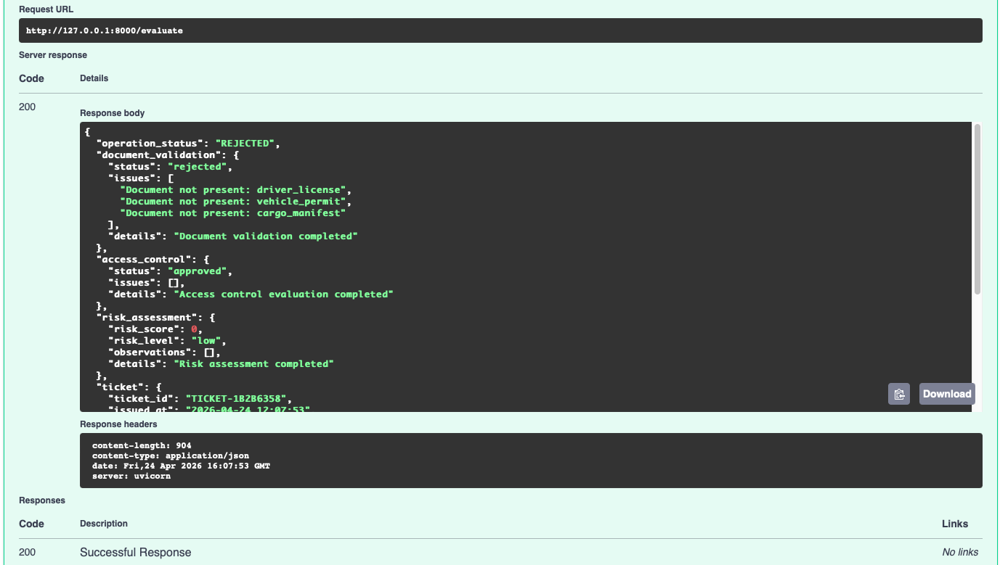
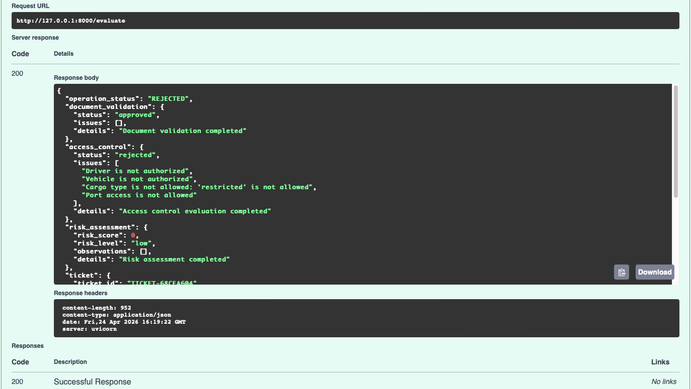
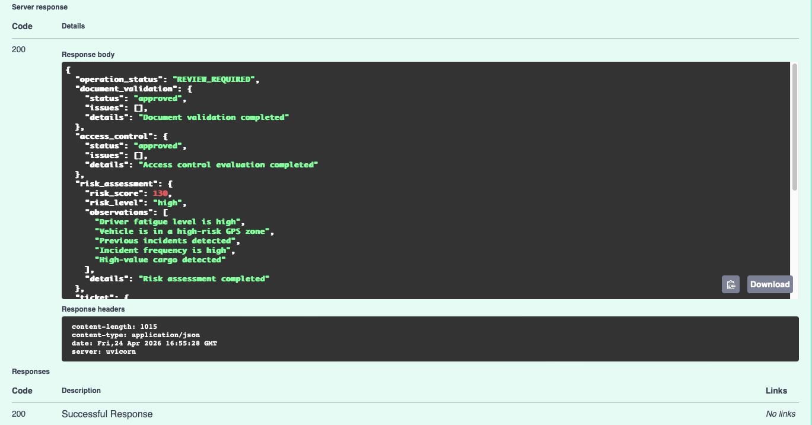
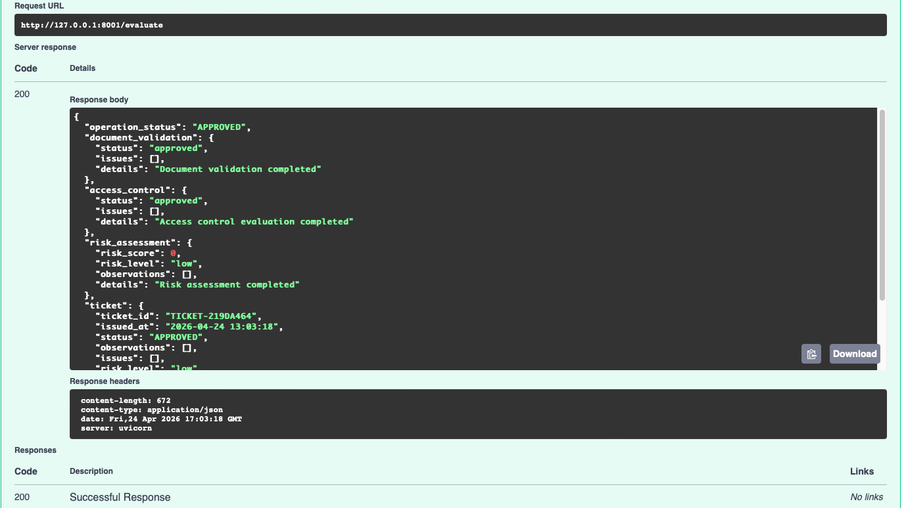

# 🚀 Plataforma Inteligente de Control Logístico


---

## 🎯 Resumen Ejecutivo

Plataforma que simula la automatización de decisiones operacionales en procesos logísticos, integrando:

* Validación documental
* Control de acceso de camiones y conductores
* Evaluación de riesgo logístico
* Orquestación de decisiones

💡 **Problema de negocio**
Los procesos manuales en logística generan:

* Ingreso de vehículos no autorizados
* Fraude documental
* Riesgo de robo de carga
* Baja trazabilidad operacional

🚀 **Solución propuesta**
Definición de un flujo integrado de decisiones expuesto mediante una API REST, permitiendo validar operaciones de forma automatizada en un entorno simulado.

---

## 👩‍💼 Rol en el proyecto

Este proyecto fue desarrollado desde un enfoque de **Gestión de Entrega (Delivery Management)**, integrando:

* Definición del enfoque de solución
* Priorización de backlog y roadmap
* Modelamiento del flujo operacional
* Aseguramiento de calidad (testing + CI/CD)
* Enfoque en generación de valor de negocio

💡 Este repositorio no busca representar una implementación técnica profunda,
sino la capacidad de **liderar, estructurar y validar soluciones tecnológicas de extremo a extremo**.

---

## 🧩 Problema de Negocio

En operaciones logísticas y de comercio exterior existen múltiples puntos críticos:

* Validaciones manuales de acceso a recintos
* Ingreso de camiones no autorizados
* Procesos documentales propensos a errores
* Falta de trazabilidad en la toma de decisiones

👉 Esto impacta directamente en:

* Seguridad operacional
* Continuidad del servicio
* Costos operativos
* Experiencia del cliente

---

## 🏗️ Estructura de la Solución

La solución se basa en un flujo de validación compuesto por:

* Validación documental
* Control de acceso
* Evaluación de riesgo
* Orquestación de decisiones

📌 Componentes principales:

```bash
app/
 ├── api.py
 ├── orchestrator.py
 └── services/
      ├── document_validator.py
      ├── access_control.py
      ├── risk_assessor.py
      ├── ticket_generator.py
      └── notification_service.py
```

---

## ⚙️ Ejecución en Entorno de Desarrollo

```bash
git clone https://github.com/vermaldonado-ia/intelligent-logistics-control-platform.git
cd intelligent-logistics-control-platform
pip install -r requirements.txt
PYTHONPATH=. python -m uvicorn app.api:app --reload
```

**Swagger:**
http://127.0.0.1:8000/docs

---

## 🧪 Casos de Validación Operativa

| Caso                 | Resultado          | Evidencia                             |
| -------------------- | ------------------ | ------------------------------------- |
| Documentos faltantes | RECHAZADO          |  |
| Acceso inválido      | RECHAZADO          |     |
| Riesgo alto          | REVISIÓN REQUERIDA |           |
| Operación válida     | APROBADO           |            |

---

## 🔍 Evidencia Técnica

### ✅ Integración Continua (CI/CD)

* Pipeline automatizado con GitHub Actions
* Validación en cada Pull Request

📸 Evidencia:


---

### 🧪 Pruebas Automatizadas y Cobertura

* Pruebas con pytest
* Validación de cobertura

📸 Evidencia:


---

### 🔎 Calidad de Código

* Validación de estándares de código
* Integración de control de calidad

📸 Evidencia:


---

### 🚀 API en Producción

La API se encuentra desplegada en entorno cloud:

🔗 https://logistics-api-veronica.onrender.com/docs

📸 Evidencia:


---

## 📊 Gestión de Producto (Azure DevOps)

La solución fue diseñada bajo un enfoque de producto, con backlog priorizado y roadmap evolutivo:

* 📄 Product Backlog: ./product_backlog.md
* 🚀 Product Roadmap: ./product_roadmap.md
* 📸 Evidencia Board: ./azure_devops/boards_evidencia.md

✔ Definición de épicas, historias y tareas
✔ Priorización basada en valor de negocio
✔ Trazabilidad del desarrollo

---

## 💼 Capacidades Demostradas

* Liderazgo en entrega de soluciones tecnológicas
* Definición de enfoques técnicos de solución
* Diseño de flujos operacionales
* Implementación de CI/CD
* Pruebas automatizadas
* Gestión de backlog con Azure DevOps
* Enfoque MVP orientado a valor

---

## 📈 Impacto Esperado

* Reducción de errores manuales
* Disminución de riesgos logísticos
* Mejora en control de accesos
* Incremento en trazabilidad operacional

---

## 🚀 Hoja de Ruta

Evolución del producto en fases incrementales:

* MVP1: Validación del flujo operacional
* MVP2: Integración con servicios externos
* MVP3: Automatización avanzada
* MVP4: Escalabilidad y analítica

---

## 🔮 Próximos Pasos

✔ Integración con APIs externas reales
✔ Incorporación de modelos de IA para evaluación de riesgo
✔ Evolución hacia arquitectura distribuida
✔ Integración con dispositivos IoT (GPS, sensores)

---

## 🧠 Conclusión

Este proyecto demuestra la capacidad de:

* Traducir problemas de negocio en soluciones tecnológicas
* Estructurar productos digitales desde cero
* Integrar prácticas modernas de desarrollo
* Validar soluciones mediante evidencia técnica

👉 Enfocado en un perfil de **Delivery Manager con visión técnica y de producto**.
