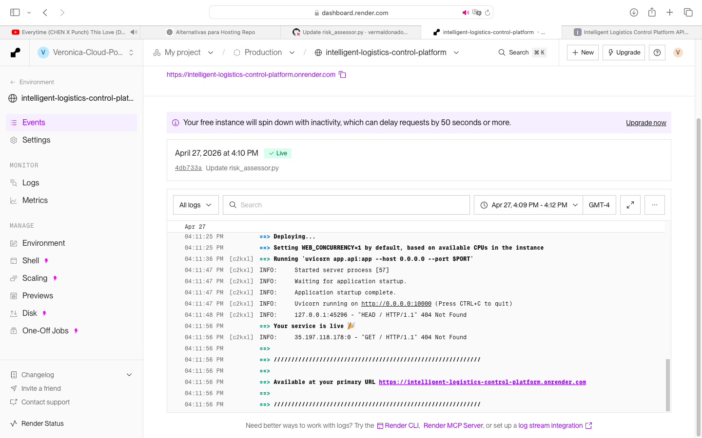
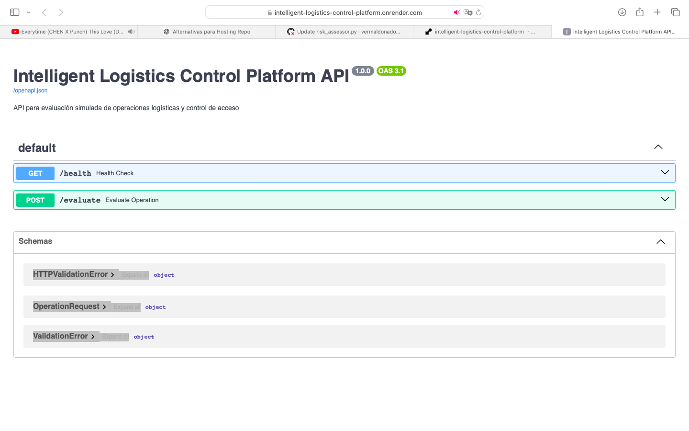
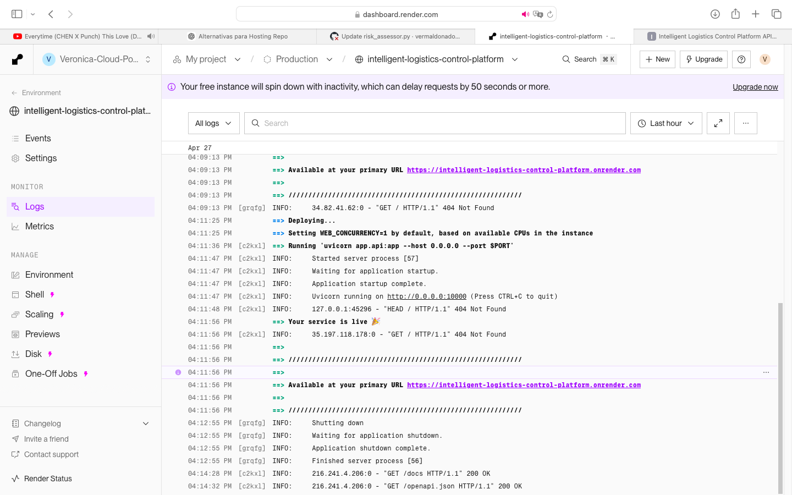
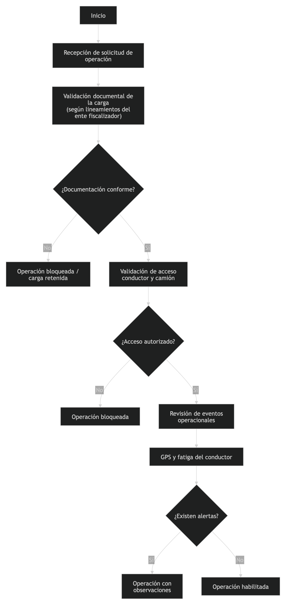

# 🚀 Plataforma Inteligente de Control Logístico

---

## 🎯 Resumen Ejecutivo

Plataforma desplegada en producción que simula decisiones operacionales en procesos logísticos críticos, integrando:

* Validación documental
* Control de acceso
* Evaluación de riesgo operacional
* Orquestación de decisiones

👉 API pública + CI/CD + Quality Gate + Deploy en Cloud

---

## 🔗 Accesos en Producción

**🌐 API en producción**  
https://intelligent-logistics-control-platform.onrender.com  

**📘 Swagger (documentación interactiva)**  
https://intelligent-logistics-control-platform.onrender.com/docs  

---

### 🚀 Características del despliegue

- ✔ Deploy automático desde GitHub  
- ✔ API pública accesible  
- ✔ Documentación interactiva  
- ✔ Runtime en cloud  

---

⚠️ **Nota:**  
Al estar en free tier, la aplicación puede tardar unos segundos en iniciar.

---

## 📸 Evidencia real en producción

### 🌐 API desplegada en Render

---

### 📘 Swagger en producción

---

### ⚙️ Logs de ejecución

---

## 👩‍💼 Rol en el proyecto

Este proyecto fue desarrollado desde un enfoque de **Delivery Management**, integrando:

* Definición del enfoque de solución
* Priorización de backlog y roadmap
* Modelamiento del flujo operacional
* Aseguramiento de calidad (testing + CI/CD)
* Enfoque en valor de negocio

👉 No representa solo una implementación técnica, sino la capacidad de liderar soluciones end-to-end.

---

## 🧩 Problema de Negocio

En operaciones logísticas reales existen múltiples puntos críticos:

* Validación manual de documentos
* Ingreso de camiones no autorizados
* Falta de control sobre conductores y vehículos
* Evaluación tardía de riesgos operacionales
* Procesos lentos y propensos a error

👉 Impacto directo:

* Seguridad operativa
* Continuidad del servicio
* Trazabilidad
* Eficiencia del proceso

---

## 📊 Antes vs Después

| Antes                 | Después                           |
| --------------------- | --------------------------------- |
| Validaciones manuales | Validación automatizada           |
| Procesos lentos       | Decisiones automatizadas          |
| Alto riesgo operativo | Evaluación automatizada de riesgo |
| Baja trazabilidad     | Trazabilidad completa             |

---

## 💡 Solución

Se define un flujo de decisiones automatizado que permite:

✔ Validar documentación
✔ Evaluar condiciones de acceso
✔ Analizar riesgo operacional
✔ Orquestar decisiones
✔ Generar tickets
✔ Emitir notificaciones

---

## 🏗️ Estructura de la Solución

La solución se basa en un flujo de validación compuesto por:

* Validación documental
* Control de acceso
* Evaluación de riesgo
* Orquestación de decisiones

📊 Flujo operacional:

📌 Componentes principales:

app/
├── api.py
├── orchestrator.py
└── services/
    ├── document_validator.py
    ├── access_control.py
    ├── risk_assessor.py
    ├── ticket_generator.py
    └── notification_service.py

---

## 🧠 Enfoque del Proyecto

Proyecto diseñado desde una perspectiva de **negocio + delivery**, enfocado en:

✔ Modelamiento de decisiones operacionales reales
✔ Orquestación de reglas de negocio
✔ Simulación de escenarios críticos
✔ Generación de resultados trazables

---

## 🔄 Flujo de la Solución

1. Recepción de datos
2. Validación documental
3. Evaluación de acceso
4. Análisis de riesgo
5. Toma de decisión
6. Generación de ticket
7. Notificación

📌 Ver diagrama: [Flujo Operacional](diagrams/flujo_operacional_general.png)

---

## 🚨 Escenarios de decisión

❌ Documentos faltantes → REJECTED
❌ Documento expirado → REJECTED
⚠️ Riesgo alto → REVIEW_REQUIRED
✔️ Operación válida → APPROVED

---

## 📸 Evidencia de Ejecución

| Caso | Resultado | Evidencia |
|------|----------|-----------|
| Documentos faltantes | REJECTED |  |
| Acceso inválido | REJECTED |  |
| Riesgo alto | REVIEW_REQUIRED |  |
| Operación válida | APPROVED |  |

---

## 🔌 Endpoints

### ✔ Health Check

GET /health

Respuesta:
{"status": "ok"}

### ✔ Evaluación de Operación

POST /evaluate

---

## 🧪 Pruebas y Calidad

pytest -v
pytest --cov=app

✔ Integración CI
✔ Validación de calidad
✔ Control de cobertura

---

## ⚙️ Integración CI/CD y Calidad

Pipeline automatizado:

Push → GitHub Actions → Tests → Lint → Coverage → SonarCloud

📊 Resultados:

✔ Quality Gate: Passed
✔ Coverage: ~85%
✔ Maintainability: A
✔ Reliability: A
✔ Security: A

---

## ⚙️ Ejecución en Entorno de Desarrollo

git clone https://github.com/vermaldonado-ia/intelligent-logistics-control-platform.git
cd intelligent-logistics-control-platform
pip install -r requirements.txt
PYTHONPATH=. python -m uvicorn app.api:app --reload

Swagger:
http://127.0.0.1:8000/docs

---

## ⚙️ Tecnologías

Python
FastAPI
Pytest
Flake8
Coverage
GitHub Actions
SonarCloud

---

## 📈 Valor para el negocio

✔ Reducción de riesgos
✔ Mejora en tiempos de validación
✔ Automatización de procesos
✔ Mayor trazabilidad

---

## 🚀 Estrategia de Desarrollo

Desarrollo basado en MVPs incrementales.

### 🧩 MVP1

Validación del flujo operacional completo

---

## 🎯 Visión del Producto

Automatizar decisiones logísticas con foco en:

* Control
* Trazabilidad
* Reducción de riesgos

---

## 📊 Gestión del Delivery (Azure DevOps)

✔ Backlog estructurado
✔ Historias y tareas
✔ Priorización por valor
✔ Tablero Kanban
✔ Trazabilidad completa

🔗 Evidencia: ./azure_devops/boards_evidencia.md

---

## 📊 Gestión de Producto

📄 Product Backlog
🚀 Product Roadmap
🔗 Evidencia de gestión

---

## 🚀 Próximos pasos

✔ Integración con APIs reales
✔ IA para scoring de riesgo
✔ Arquitectura distribuida
✔ Integración con IoT

---

## 🎯 Valor diferencial

✔ Diseño orientado a negocio
✔ Automatización de decisiones
✔ Integración DevOps
✔ Entrega en producción

👉 Representa el rol de un Delivery Manager moderno.

---

## 👩‍💻 Autor

Verónica Maldonado Céspedes
Cloud & DevOps Delivery Manager
Project Manager | Transformación Digital

