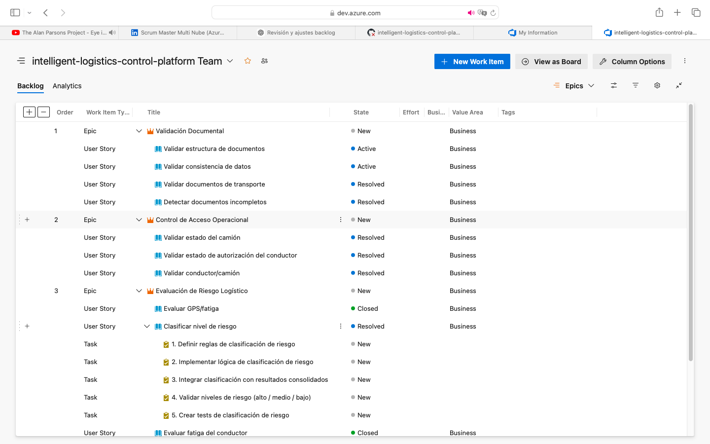
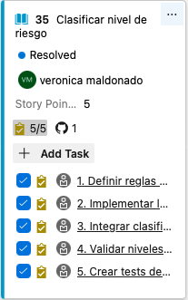
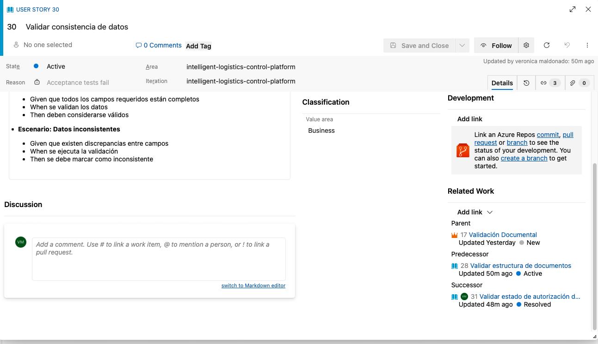
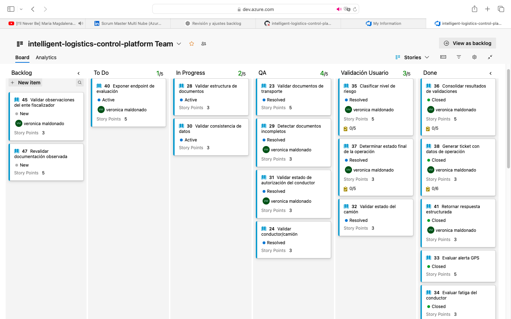
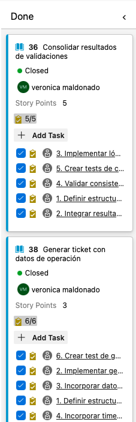
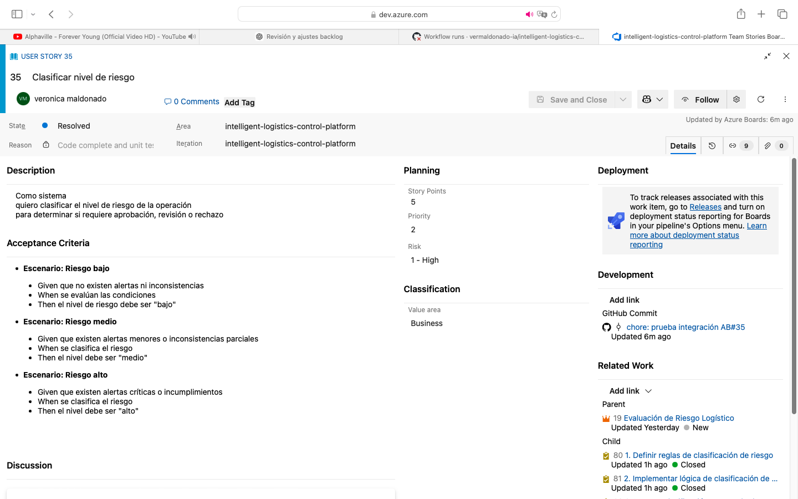
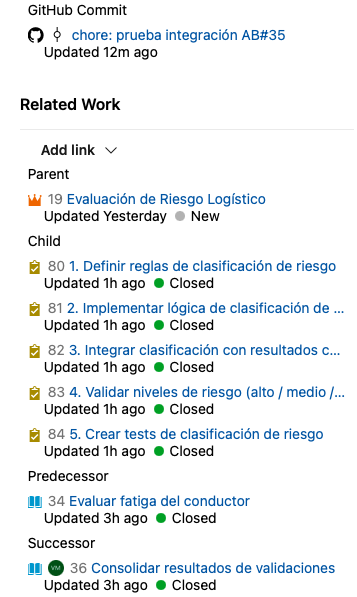

# 📊 Evidencia de Gestión — Azure DevOps

## 🎯 Trazabilidad del Delivery

Se implementó una gestión completa del backlog utilizando Azure DevOps, asegurando trazabilidad desde requerimientos hasta entrega.

---

## 🧱 Backlog estructurado

---

## 📖 Detalle de Historia de Usuario

---

## 🔧 Tareas asociadas

---

## 🔄 Gestión del flujo (Kanban)

---

## ✔ Entrega de valor (Historia completada)

---

## 🔗 Trazabilidad end-to-end

Se implementó trazabilidad completa entre la gestión del backlog y la implementación técnica del sistema.

### 📸 Evidencia de trazabilidad

#### Gestión y planificación

#### Ejecución técnica y vinculación a código

---

Esto permite visualizar:

* Definición del requerimiento
* Planificación del trabajo (Story Points y riesgo)
* Ejecución mediante tareas técnicas
* Vinculación directa con commits en GitHub

---

✔ Asegura visibilidad completa del ciclo de desarrollo
✔ Permite seguimiento desde requerimiento hasta implementación
✔ Refleja prácticas reales de gestión en entornos DevOps
